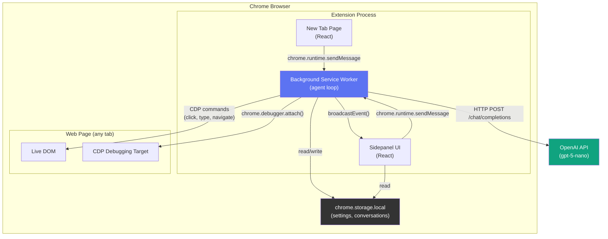

# EDITH — Project Review Document
### *Even Dead, I'm The Hero*
**A Browser-Native AI Agent for Real-Time Web Automation**

---

## 1. Project Overview

EDITH is an **AI-powered browser extension** that allows users to automate real-world browser tasks through natural language. A user simply types *"Go to YouTube and search for VS Code tutorials"* and EDITH autonomously opens YouTube, finds the search box, types the query, presses Enter, and reports back — all inside the user's actual browser, with full visual feedback.

It is **not** a chatbot with a web wrapper. It is not a headless scraper. It is an autonomous agent that sees, reasons, and acts inside a live Chrome tab, exactly as a human would.

---

## 2. Technology Stack

| Layer | Technology | Why This Choice |
|---|---|---|
| **Extension Runtime** | [WXT](https://wxt.dev/) (Web Extension Toolkit) | Framework-agnostic extension build tool. Handles manifest generation, hot reload, entrypoint routing, and cross-browser support. Compiles TypeScript → Chrome MV3 extension. |
| **Language** | TypeScript | Type safety across the entire codebase. Catches bugs at compile time — critical for an agent that sends CDP commands. |
| **UI Framework** | React 18 | Sidepanel chat UI. React's state model handles real-time progress updates, conversation history, and mode switching cleanly. |
| **Browser Automation** | **Chrome DevTools Protocol (CDP)** via `chrome.debugger` API | The core innovation — explained in detail below. |
| **LLM Interface** | OpenAI SDK (`openai` npm package) | Any OpenAI-compatible API (gpt-4o-mini, gpt-5-nano, local LLMs via LMStudio/Ollama). |
| **Storage** | `chrome.storage.local` | All data stays on-device. No backend server, no database. |
| **Build & Bundle** | Vite 7 (via WXT) | Sub-4-second production builds. Tree-shaking removes dead code. |

---

## 3. Architecture — Deep Dive

### 3.1 System Architecture Diagram



### 3.2 The Three Execution Contexts

Chrome extensions run code in **three isolated contexts**. Understanding this is critical:

| Context | File | Runs Where | Lifespan | Can Access |
|---|---|---|---|---|
| **Background Service Worker** | `entrypoints/background/index.ts` | Extension's V8 isolate | Persistent while extension is loaded | `chrome.*` APIs, network, storage. **Cannot** access DOM. |
| **Sidepanel UI** | `entrypoints/sidepanel/App.tsx` | Rendered in Chrome's side panel | While panel is open | React rendering, `chrome.runtime.sendMessage` to talk to background |
| **Content/Injected Script** | Injected via `Runtime.evaluate` | Inside the **target web page's** JS context | Per-execution | Full DOM access — `document.querySelector`, `window`, etc. |

The service worker **orchestrates everything**. It receives user messages from the sidepanel, calls the LLM, and sends CDP commands to the target tab. It never touches the DOM directly — that happens via injected scripts.

---

## 4. Browser Automation — The Core Innovation

### 4.1 Why CDP via `chrome.debugger`?

Most browser automation tools (Selenium, Playwright, Puppeteer) use **headless Chrome** — a separate browser process with no visible window. This has three fatal problems:

1. **Websites detect headless Chrome** — missing `window.chrome`, `navigator.webdriver === true`, missing GPU fingerprint
2. **User's real session isn't available** — no cookies, no login state, no saved passwords
3. **Requires installing a separate binary** — Chromium, chromedriver, or a Node.js server

EDITH solves all three by using the `chrome.debugger` API:

```typescript
// Attach to any open tab — the user's REAL Chrome session
await chrome.debugger.attach({ tabId: 12345 }, '1.3');

// Send CDP commands to that tab
await chrome.debugger.sendCommand(
    { tabId: 12345 },
    'Input.dispatchMouseEvent',
    { type: 'mousePressed', x: 400, y: 300, button: 'left', clickCount: 1 }
);
```

This is the **same protocol** that Chrome DevTools uses. When you open Chrome DevTools and click "Elements" or "Console", it uses CDP internally. Our extension does the same thing, but programmatically.

### 4.2 The Automation Pipeline

```mermaid
sequenceDiagram
    participant U as User
    participant SP as Sidepanel
    participant BG as Service Worker
    participant LLM as OpenAI API
    participant TAB as Browser Tab

    U->>SP: "Search YouTube for VS Code tutorials"
    SP->>BG: { type: "AGENT_RUN", prompt: "..." }
    BG-->>SP: ack (immediately)
    
    loop Agent Loop (max 30 steps)
        BG->>LLM: System prompt + history + tools
        LLM-->>BG: tool_call: open_browser("https://youtube.com")
        BG->>TAB: chrome.tabs.create({ url })
        BG->>TAB: chrome.debugger.attach()
        BG-->>SP: progress("🔧 open_browser")
        
        BG->>LLM: tool result + history
        LLM-->>BG: tool_call: take_snapshot()
        BG->>TAB: Runtime.evaluate(snapshotScript)
        TAB-->>BG: { elements: [{uid:1, tag:"input", ...}, ...] }
        
        BG->>LLM: snapshot data
        LLM-->>BG: tool_call: type_text(uid:1, "vs code tutorials")
        BG->>TAB: Input.dispatchKeyEvent (per character)
        
        BG->>LLM: result
        LLM-->>BG: tool_call: press_key("Enter")
        BG->>TAB: Input.dispatchKeyEvent("Enter")
        
        BG->>LLM: result
        LLM-->>BG: tool_call: task_complete("Searched YouTube for VS Code tutorials")
        BG->>TAB: chrome.debugger.detach()
        BG-->>SP: { type: "agent_done" }
    end
    
    SP->>U: "✅ Searched YouTube for VS Code tutorials"
```



### 4.3 DOM Snapshot System

The agent needs to "see" the page. Instead of screenshots (expensive, requires vision models), we **inject a JavaScript function** into the page that walks the DOM tree and extracts all interactive elements:

```typescript
const snapshotScript = function() {
    const elements = [];
    const walker = document.createTreeWalker(document.body, NodeFilter.SHOW_ELEMENT);
    
    while (walker.nextNode()) {
        const node = walker.currentNode;
        // Only collect interactive elements: inputs, buttons, links
        if (isClickable(node) || hasRole(node)) {
            elements.push({
                uid: counter++,        // Stable reference ID
                tag: 'input',
                name: node.getAttribute('aria-label') || node.innerText,
                placeholder: node.getAttribute('placeholder'),
                x: rect.left, y: rect.top,   // For click coordinates
                isInput: true,
                isClickable: true,
            });
        }
    }
    return JSON.stringify({ url: location.href, title: document.title, elements });
};
```

The LLM receives output like:
```
URL: https://www.youtube.com
Title: YouTube

ELEMENTS (uid | type | label):
  1 | INPUT | "Search"
  2 | BUTTON | "Search"
  3 | LINK | "Home"
  14 | VIDEO | "VS Code Tutorial for Beginners"
```

It then calls `type_text(uid=1, text="vs code tutorials")` and the service worker resolves UID 1 → coordinates (x=400, y=52) → sends a CDP mouse click at that point → then dispatches key events for each character.

### 4.4 CDP Typing — Character-Level Input

Most web apps (YouTube, Google, React SPAs) use JavaScript event listeners, not native HTML form handling. Simply setting `input.value = "text"` does **not** work — React never sees the change.

Our approach dispatches **real keyboard events** through CDP:

```typescript
for (const char of text) {
    // 1. keyDown — tells the browser a key was pressed (no text insertion)
    await cdp(tabId, 'Input.dispatchKeyEvent', {
        type: 'keyDown',
        key: char,
        code: `Key${char.toUpperCase()}`,
        windowsVirtualKeyCode: char.toUpperCase().charCodeAt(0),
        // NOTE: No `text` field here — avoids double-insertion
    });
    
    // 2. char — this is what actually inserts the character
    await cdp(tabId, 'Input.dispatchKeyEvent', {
        type: 'char',
        key: char,
        text: char,
        unmodifiedText: char,
    });
    
    // 3. keyUp — release the key
    await cdp(tabId, 'Input.dispatchKeyEvent', {
        type: 'keyUp',
        key: char,
    });
    
    await sleep(40); // Human-like typing speed
}
```

This three-phase `keyDown → char → keyUp` cycle is exactly what happens when a human presses a key. React's synthetic event system picks it up correctly.

---

## 5. LLM Integration

### 5.1 Model-Agnostic Design

EDITH doesn't hardcode any model. It uses the OpenAI Chat Completions API format — any provider that speaks this protocol works:

| Provider | Model | Cost | Works? |
|---|---|---|---|
| OpenAI | gpt-4o-mini, gpt-5-nano | Pay-per-use | ✅ |
| Google | Gemini (via OpenAI-compatible endpoint) | Free tier available | ✅ |
| Ollama | llama3, CodeLlama (local) | Free | ✅ |
| LMStudio | Any GGUF model (local) | Free | ✅ |
| Groq | llama3-70b | Free tier | ✅ |

The user just changes the **API Base URL** and **Model** in settings. No code changes needed.

### 5.2 Tool Calling (Function Calling)

The LLM doesn't execute actions directly. Instead, we define **tools** using OpenAI's function calling schema:

```typescript
{
    name: 'click',
    description: 'Click an element by its UID from the snapshot.',
    parameters: {
        type: 'object',
        properties: {
            uid: { type: 'number', description: 'UID from snapshot' },
        },
        required: ['uid'],
    },
}
```

The LLM returns structured JSON:
```json
{
    "tool_calls": [{
        "id": "call_abc123",
        "function": {
            "name": "click",
            "arguments": "{\"uid\": 14}"
        }
    }]
}
```

Our service worker parses this, executes the action, and feeds the result back. This loop continues until the LLM calls `task_complete()`.

### 5.3 Tools Available

| Tool | Purpose |
|---|---|
| `open_browser(url)` | Open a new tab with a URL |
| `navigate(url)` | Navigate the current tab |
| `take_snapshot()` | Get all interactive elements with UIDs |
| `click(uid)` | Click an element by UID |
| `type_text(uid, text)` | Type text into an input field |
| `press_key(key)` | Press Enter, Tab, Escape, etc. |
| `scroll(direction, amount)` | Scroll the page |
| `screenshot()` | Capture the visible page |
| `task_complete(summary)` | Signal task is done, release browser |

### 5.4 Context Window Management

A browsing task can take 10-20 steps. Each step generates snapshot data (potentially hundreds of elements). If we send the entire history every time, we:
- Exceed the model's context window
- Waste tokens (= money)
- Trigger safety filters from accumulated page data

**Solution: `pruneHistory()`** — before every LLM call, we keep only:
- All user messages (so the model remembers the original task)
- The last 6 rounds of tool interactions
- This keeps context under ~8K tokens per call

---

## 6. Security Architecture

### 6.1 Data Flow — Nothing Leaves Without You Knowing

```mermaid
graph LR
    subgraph "YOUR MACHINE (local only)"
        API_KEY["API Key"]
        CONVOS["Conversations"]
        SETTINGS["Settings"]
    end
    
    subgraph "OUTBOUND (only destination)"
        OPENAI["api.openai.com"]
    end
    
    subgraph "NEVER ACCESSED"
        COOKIES["🚫 Cookies"]
        PASSWORDS["🚫 Saved Passwords"]
        LOCALSTORAGE["🚫 localStorage"]
        HISTORY["🚫 Browser History"]
    end
    
    API_KEY -->|"Authorization header"| OPENAI
    CONVOS -->|"message history"| OPENAI
    
    style COOKIES fill:#ff4444,color:#fff
    style PASSWORDS fill:#ff4444,color:#fff
    style LOCALSTORAGE fill:#ff4444,color:#fff
    style HISTORY fill:#ff4444,color:#fff
```



### 6.2 Security Measures Implemented

| Measure | Code Location | What It Prevents |
|---|---|---|
| Password fields excluded from snapshot | `automation.ts` line 175 | Credentials never reach LLM |
| Hidden fields excluded from snapshot | `automation.ts` line 175 | Hidden tokens never exposed |
| Input `.value` never read | `automation.ts` line 190 | Typed content stays local |
| No `fetch()` calls in codebase | Verified via grep | No data exfiltration to third parties |
| No `document.cookie` access | Verified via grep | Session hijacking impossible |
| No `chrome.cookies` API | Not in manifest.json | Extension cannot read any cookies |
| `chrome.storage.local` only | `storage.ts` | Data never synced to Chrome cloud |
| Debugger auto-detaches on completion | `background/index.ts` | Extension releases tab control after task |

---

## 7. Extension Manifest (Permissions Explained)

```json
{
    "manifest_version": 3,
    "permissions": [
        "debugger",       // CDP access to tabs for automation
        "sidePanel",      // Show chat UI in Chrome's side panel
        "storage",        // Save settings & conversations locally
        "tabs",           // Query which tab is active
        "activeTab",      // Access the current tab's URL/title
        "scripting",      // Inject snapshot script into pages
        "alarms",         // Scheduled tasks (future feature)
        "notifications"   // Notify user when tasks complete (future)
    ],
    "host_permissions": ["<all_urls>"]  // Automate any website
}
```

Every permission is justified. `host_permissions: <all_urls>` is required because the agent needs to automate **any** site the user asks (YouTube, Amazon, GitHub, etc.).

---

## 8. Message Protocol

Communication between sidepanel and service worker uses `chrome.runtime.sendMessage`:

### Chat Mode (synchronous):
```
Sidepanel → { type: "CHAT", prompt: "What is React?" }
Background → calls OpenAI → waits → responds
Background → { ok: true, conversationId: "abc-123" }
Sidepanel → reads updated conversation from storage
```

### Agent Mode (fire-and-forget + events):
```
Sidepanel → { type: "AGENT_RUN", prompt: "Go to YouTube..." }
Background → { ok: true } (immediate ack)
Background → starts agent loop...
    → broadcasts: { type: "agent_progress", text: "🔧 open_browser" }
    → broadcasts: { type: "agent_progress", text: "📸 Snapshot: YouTube" }
    → broadcasts: { type: "agent_progress", text: "🔧 type_text" }
    → broadcasts: { type: "agent_done", conversationId: "abc-123" }
Sidepanel → reads final conversation from storage
```

The fire-and-forget pattern is critical because agent tasks can take 30-90 seconds. Chrome's `sendMessage` has a timeout — if we awaited the full response, it would fail silently.

---

## 9. File Structure

```
extension/
├── wxt.config.ts                    # WXT build configuration
├── package.json                     # Dependencies
├── tsconfig.json                    # TypeScript configuration
│
├── entrypoints/
│   ├── background/
│   │   └── index.ts                 # Service worker — agent loop, message handler
│   ├── sidepanel/
│   │   ├── index.html               # Sidepanel HTML shell
│   │   ├── main.tsx                  # React mount point
│   │   └── App.tsx                   # Full chat UI (420 lines)
│   └── newtab/
│       ├── index.html                # New tab HTML shell
│       └── main.tsx                  # Clock + quick task input
│
├── lib/
│   ├── automation.ts                # CDP browser control (450 lines)
│   ├── llm.ts                       # OpenAI API client
│   ├── agent.ts                     # System prompt, tools, snapshot formatter
│   └── storage.ts                   # chrome.storage.local CRUD
│
├── assets/
│   └── global.css                   # EDITH design system (CSS variables)
│
└── .output/
    └── chrome-mv3/                  # Built extension (load this in Chrome)
        ├── manifest.json
        ├── background.js
        ├── sidepanel.html
        ├── newtab.html
        ├── chunks/
        └── assets/
```

---

## 10. Anticipated Panel Questions & Answers

---

### **Q1: "Why not use Selenium or Playwright instead of CDP?"**

Selenium and Playwright launch **separate headless browser processes**. This means:
- The user's cookies, login sessions, and saved passwords are not available
- Websites easily detect headless Chrome (`navigator.webdriver === true`)
- It requires installing Chromium binaries (700MB+)

CDP via `chrome.debugger` operates **inside the user's actual Chrome browser**. The browser fingerprint is real. The session is real. The cookies are real. No additional software is needed — it's a 280KB extension.

---

### **Q2: "How does the LLM know what's on the page?"**

We inject a DOM traversal script via `Runtime.evaluate` that walks the full DOM tree and extracts:
- Every interactive element (inputs, buttons, links, videos)
- Their semantic labels (`aria-label`, `title`, `placeholder`, `innerText`)
- Their bounding box coordinates (for click targeting)
- A unique integer UID for reference

This creates a **structured text representation** of the page. The LLM reads text like `"UID=3 | INPUT | Search"` and responds with `type_text(uid=3, text="vs code")`. It never sees raw HTML, screenshots, or the visual layout — just a clean element list.

---

### **Q3: "What if the LLM calls the wrong tool or clicks the wrong element?"**

The agent loop has multiple safeguards:
1. **Max 30 steps** — prevents infinite loops
2. **`task_complete()` tool** — LLM explicitly signals when done; debugger detaches immediately
3. **Snapshot invalidation** — after every click/type action, the old snapshot is discarded. The agent must call `take_snapshot()` again to see the updated page.
4. **Error handling** — if a CDP command fails, the error is sent back to the LLM as a tool result, allowing it to try an alternative approach

However, the agent IS imperfect. LLMs sometimes:
- Click the wrong UID
- Navigate to an unrelated site (mitigated by system prompt restrictions)
- Loop unnecessarily

This is a fundamental limitation of LLM-based agents — no AI agent today is 100% reliable.

---

### **Q4: "Is this extension safe to use on personal accounts?"**

Yes, with caveats:
- **Chrome/Google**: No risk. `chrome.debugger` is an official API used by thousands of extensions.
- **YouTube/Amazon**: No risk for personal browsing tasks. These platforms target bots doing mass scraping, ad fraud, or automated purchases — not personal automation.
- **LinkedIn**: Low risk for browsing. Do NOT automate bulk messaging or connection requests — LinkedIn actively bans that.
- **Data safety**: No cookies, passwords, or session tokens leave the machine. Only visible page labels are sent to OpenAI.

---

### **Q5: "Why didn't you use browser vision (screenshots + GPT-4V) instead of text snapshots?"**

Three reasons:
1. **Cost**: GPT-4V with vision costs ~10-50x more per call than text-only models. A 10-step task with vision could cost $0.50-$2.
2. **Speed**: Encoding and transmitting screenshot images adds 2-5 seconds per step.
3. **Accuracy**: Text-based element lists with UIDs give the LLM **exact coordinates** for clicking. Vision models guess pixel coordinates and are often wrong by 20-50px.

Text snapshots are faster, cheaper, and more accurate for structured web pages.

---

### **Q6: "How does typing work in React applications like YouTube search?"**

React uses a virtual DOM and synthetic event system. Setting `input.value = "text"` directly does **not** trigger React's `onChange` handler. The input visually updates but React's internal state stays empty.

Our solution dispatches CDP `Input.dispatchKeyEvent` calls that generate **real browser keyboard events**:
- `keyDown` (key press signal — no text insertion)
- `char` (actual character insertion)
- `keyUp` (key release)

These are indistinguishable from a human typing. React's event delegation picks them up through `document.addEventListener`, and `onChange` fires correctly.

We initially had a bug where `keyDown` carried the `text` field, causing each character to be inserted twice (`"vvss ccooddee"`). The fix was ensuring only the `char` event carries the `text` payload.

---

### **Q7: "What happens if the service worker goes to sleep?"**

Chrome MV3 service workers have a 5-minute idle timeout. However, our agent loop maintains active network connections (LLM API calls) and CDP commands, which keep the service worker alive. Chrome doesn't terminate a service worker that has active `chrome.debugger` connections.

If the worker does terminate mid-task (e.g., Chrome update), the debugger auto-detaches and the task stops. The conversation history is already saved to storage, so the user can see how far it got.

---

### **Q8: "Can this extension be published to the Chrome Web Store?"**

Technically yes, but with restrictions:
- Extensions using the `debugger` permission require extra review by Google
- The `host_permissions: <all_urls>` requires justification
- Google may request a detailed privacy policy explaining what data goes to OpenAI
- Many automation-focused extensions exist on the store (Selenium IDE, Automa, etc.) — there is precedent

---

### **Q9: "How is this different from BrowserOS, the open-source AI browser?"**

| Aspect | BrowserOS | EDITH |
|---|---|---|
| Architecture | Custom Chromium fork + extension | Standard Chrome extension only |
| Browser requirement | Must download their custom browser | Works in any Chrome/Edge |
| Automation API | Custom `chrome.browserOS.*` (proprietary) | Standard `chrome.debugger` (CDP) |
| LLM provider | Multi-provider via Vercel AI SDK | Any OpenAI-compatible API |
| User's real session | ❌ Separate browser = separate cookies | ✅ Same Chrome = same session |
| Install size | ~700MB (full Chromium) | ~280KB (extension only) |
| MCP support | ✅ Built-in | 🔜 Phase 2 |

EDITH's key advantage is **zero friction** — no new browser install, everything works in the user's existing Chrome with their existing logins.

---

### **Q10: "What are the ethical implications of an AI that controls a browser?"**

Valid concern. Guardrails implemented:
1. **User must initiate every task** — the agent never acts autonomously
2. **Chrome shows a yellow banner** — "An extension is debugging this browser" is always visible
3. **`task_complete()` detaches debugger** — agent physically cannot interact after finishing
4. **System prompt restricts navigation** — blocks wandering to unrelated sites
5. **No purchase automation** — the system prompt says "never confirm purchases without explicit user approval"

The extension is a tool, not an autonomous system. It cannot install itself, cannot run without the user's Chrome, and cannot bypass the debugger permission dialog.
