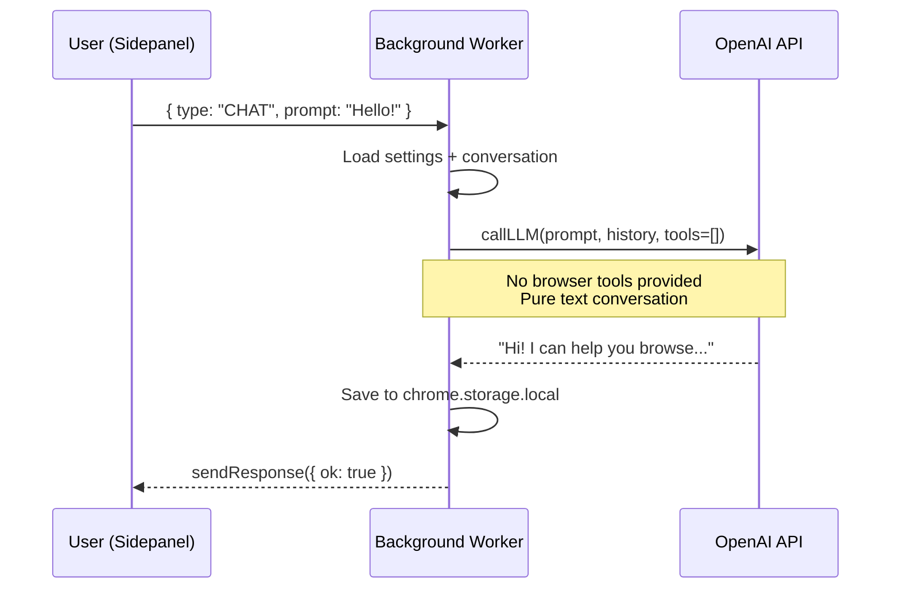
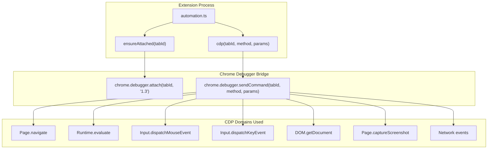
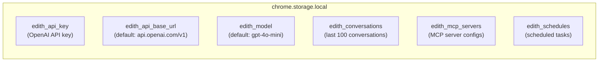

# EDITH — Complete Technical Architecture Report

> **EDITH** — *Elite Digital Intelligence & Task Handler*
> A Chrome Extension-based AI agent with autonomous browser automation, multi-tab parallel research, and intelligent document processing.

---

## Table of Contents

1. [Technology Stack](#1-technology-stack)
2. [High-Level System Architecture](#2-high-level-system-architecture)
3. [Extension Architecture — The Core Agent](#3-extension-architecture--the-core-agent)
4. [Modes of Operation](#4-modes-of-operation)
5. [Data Flow](#5-data-flow)
6. [Browser Automation Engine](#6-browser-automation-engine-cdp)
7. [Multi-Tab Research Orchestrator](#7-multi-tab-research-orchestrator)
8. [Tool Ecosystem](#8-tool-ecosystem)
9. [Document Intelligence Module](#9-document-intelligence-module)
10. [Storage & State Management](#10-storage--state-management)
11. [LLM Integration](#11-llm-integration)
12. [Project File Structure](#12-project-file-structure)
13. [Security Architecture](#13-security-architecture)

---

## 1. Technology Stack

### 1.1 Chrome Extension — Core Agent

| Technology | Version | Purpose |
|---|---|---|
| **WXT** | 0.20.17 | Chrome extension framework (Manifest V3) |
| **TypeScript** | 5.7.3 | Type-safe logic across all modules |
| **React** | 18.3.1 | Sidepanel & New Tab UI |
| **React DOM** | 18.3.1 | DOM rendering for extension pages |
| **OpenAI SDK** | 4.86.2 | LLM API calls directly from browser context |
| **TailwindCSS** | 3.4.17 | Utility-first styling for extension UI |
| **PostCSS** | 8.5.3 | CSS processing pipeline |
| **Chrome Debugger API** | CDP | DOM automation via Chrome DevTools Protocol |

**Chrome Extension Permissions:**
`debugger` · `sidePanel` · `storage` · `tabs` · `activeTab` · `scripting` · `alarms` · `notifications` · `<all_urls>`

### 1.2 Document Intelligence Module

| Technology | Purpose |
|---|---|
| **FastAPI + Uvicorn** | REST API server |
| **Sentence-Transformers** (`intfloat/e5-large-v2`) | Text embedding model |
| **FAISS (CPU)** | Vector similarity search |
| **PyMuPDF (fitz)** | PDF parsing with hyperlink extraction |
| **python-docx** | Word document parsing |
| **python-pptx** | PowerPoint parsing + embedded image OCR |
| **OpenPyXL + Pandas** | Excel/CSV parsing & analysis |
| **Pillow + Pytesseract** | OCR for images and embedded visuals |
| **Google GenAI** (`gemini-2.5-flash`) | Primary LLM for Q&A |
| **OpenAI** (`gpt-5-nano`) | Fallback LLM |
| **LangChain + LangGraph** | Interactive reasoning agent orchestration |
| **BeautifulSoup4** | Web scraping for linked documents |

### 1.3 External AI Services

| Service | Model | Role |
|---|---|---|
| **OpenAI** | `gpt-5-nano` (configurable) | Primary agent LLM — reasoning, tool-calling, intent |
| **OpenAI** | `gpt-4` | Interactive reasoning agent (Document Intelligence) |
| **Google Gemini** | `gemini-2.5-flash` | Primary LLM for document Q&A (with key rotation) |

---

## 2. High-Level System Architecture

EDITH is composed of **two independent systems** that together form the project:

```mermaid
graph TB
    subgraph "Core Agent — Chrome Extension"
        SP["Sidepanel UI<br/>(React + TailwindCSS)"]
        NT["New Tab Page"]
        BG["Background Service Worker<br/>(Message Router + Agent Loops)"]
        AM["Automation Layer<br/>(CDP Protocol)"]
        LLM_EXT["LLM Client<br/>(OpenAI SDK)"]
        RES["Research Orchestrator<br/>(Multi-Tab Parallel)"]
        STR["Storage Layer<br/>(chrome.storage.local)"]
        TABS["Browser Tabs<br/>(Real Chrome)"]

        SP -->|"chrome.runtime.sendMessage"| BG
        NT --> BG
        BG -->|"callLLM()"| LLM_EXT
        BG -->|"agent loop"| AM
        BG -->|"research plan"| RES
        RES -->|"parallel tabs"| AM
        AM -->|"chrome.debugger<br/>CDP commands"| TABS
        BG --> STR
    end

    subgraph "Document Intelligence — FastAPI Microservice"
        API["FastAPI Server<br/>POST /api/v1/hackrx/run"]
        DP["Document Parser<br/>(PDF/DOCX/PPTX/XLSX/IMG)"]
        EMB["Embedding Engine<br/>(e5-large-v2)"]
        FAISS["FAISS Vector Index"]
        RAG["RAG Pipeline<br/>(Gemini / OpenAI)"]
        AGENT["Interactive Agent<br/>(LangGraph + GPT-4)"]

        API --> DP --> EMB --> FAISS
        API --> RAG
        FAISS --> RAG
        RAG -->|"if interactive"| AGENT
    end

    LLM_EXT -->|"OpenAI API"| OAI["OpenAI<br/>gpt-5-nano"]

    style SP fill:#6C5CE7,color:#fff
    style BG fill:#FDCB6E,color:#000
    style AM fill:#00B894,color:#fff
    style RES fill:#74B9FF,color:#fff
    style API fill:#E17055,color:#fff
    style RAG fill:#A29BFE,color:#fff
```



---

## 3. Extension Architecture — The Core Agent

The extension follows a **3-layer architecture**: UI → Background Service Worker → Automation Layer.

### 3.1 Layer Breakdown

```
┌────────────────────── ENTRYPOINTS ───────────────────────────────────────┐
│                                                                          │
│  Sidepanel (entrypoints/sidepanel/)      New Tab (entrypoints/newtab/)  │
│  ├── main.tsx  → React mount             ├── main.tsx                   │
│  └── App.tsx   → Chat UI, settings       └── index.html                │
│                                                                          │
│  ── Communicates via chrome.runtime.sendMessage() ──                    │
│                                                                          │
└─────────────────────────┬────────────────────────────────────────────────┘
                          ▼
┌────────────────────── BACKGROUND SERVICE WORKER ─────────────────────────┐
│  (entrypoints/background/index.ts — 715 lines)                          │
│                                                                          │
│  Message Router:                                                         │
│    ┌──────────────┬────────────────────────────────────────────┐        │
│    │ Message Type │ Handler                                    │        │
│    ├──────────────┼────────────────────────────────────────────┤        │
│    │ CHAT         │ handleChat() → LLM-only, no browser       │        │
│    │ AGENT_RUN    │ runAgent()   → single-tab browser agent    │        │
│    │ RESEARCH_RUN │ runResearchFromPrompt() → multi-tab        │        │
│    │ AGENT_STOP   │ agentAbortFlag = true → immediate halt     │        │
│    │ GET_CONVERS  │ getConversations() → return history        │        │
│    └──────────────┴────────────────────────────────────────────┘        │
│                                                                          │
│  Scheduled Tasks:                                                        │
│    chrome.alarms → triggers runAgent() for scheduled prompts             │
│                                                                          │
└─────────────────────────┬────────────────────────────────────────────────┘
                          ▼
┌────────────────────── LIBRARY LAYER (lib/) ───────────────────────────────┐
│                                                                           │
│  agent.ts        → System prompt, browser tool definitions, snapshot fmt │
│  automation.ts   → CDP-based DOM automation (1186 lines)                 │
│  research.ts     → Multi-tab research decompose/execute/aggregate        │
│  llm.ts          → OpenAI SDK wrapper (callLLM, message formatting)      │
│  storage.ts      → chrome.storage.local CRUD for settings/conversations  │
│  tab_manager.ts  → Tab lifecycle: create, detach, track active tabs      │
│                                                                           │
└───────────────────────────────────────────────────────────────────────────┘
```

### 3.2 Key Source Files & Responsibilities

| File | Lines | Role |
|---|---|---|
| [background/index.ts](file:///d:/EDITH%20-%20Final%20yr%20project/EDITH-main/EDITH-main/extension/entrypoints/background/index.ts) | 715 | Service worker: message routing, agent loop, research runner, alarm handler |
| [agent.ts](file:///d:/EDITH%20-%20Final%20yr%20project/EDITH-main/EDITH-main/extension/lib/agent.ts) | 398 | System prompt (140 lines), `BROWSER_TOOLS` definitions (15 tools), [formatSnapshot()](file:///d:/EDITH%20-%20Final%20yr%20project/EDITH-main/EDITH-main/extension/lib/agent.ts#141-242), [pruneHistory()](file:///d:/EDITH%20-%20Final%20yr%20project/EDITH-main/EDITH-main/extension/lib/agent.ts#243-262) |
| [automation.ts](file:///d:/EDITH%20-%20Final%20yr%20project/EDITH-main/EDITH-main/extension/lib/automation.ts) | 1186 | CDP automation: `takeSnapshot()` (JS injection), `clickElement()`, `typeText()`, `pressKey()`, `scrollPage()`, `selectOption()`, `hoverElement()`, `setValue()` |
| [research.ts](file:///d:/EDITH%20-%20Final%20yr%20project/EDITH-main/EDITH-main/extension/lib/research.ts) | 523 | [decomposeTask()](file:///d:/EDITH%20-%20Final%20yr%20project/EDITH-main/EDITH-main/extension/lib/research.ts#95-138), [runSubTask()](file:///d:/EDITH%20-%20Final%20yr%20project/EDITH-main/EDITH-main/extension/lib/research.ts#190-482), [aggregateResults()](file:///d:/EDITH%20-%20Final%20yr%20project/EDITH-main/EDITH-main/extension/lib/research.ts#495-523) — MapReduce-style parallel research |
| [llm.ts](file:///d:/EDITH%20-%20Final%20yr%20project/EDITH-main/EDITH-main/extension/lib/llm.ts) | 99 | OpenAI SDK client, message format conversion, tool schema mapping |
| [storage.ts](file:///d:/EDITH%20-%20Final%20yr%20project/EDITH-main/EDITH-main/extension/lib/storage.ts) | 134 | Typed CRUD for settings, conversations (100 max), MCP servers, scheduled tasks |
| [tab_manager.ts](file:///d:/EDITH%20-%20Final%20yr%20project/EDITH-main/EDITH-main/extension/lib/tab_manager.ts) | ~100 | `createTab()`, `detachAll()`, multi-tab lifecycle for research |

---

## 4. Modes of Operation

Every user message enters the background service worker and is routed to one of **four execution modes**:

### 4.1 CHAT Mode — Simple Conversation



**Characteristics:**
- **No browser tools** are passed to the LLM (empty tools array)
- Synchronous response — sidepanel waits for `sendResponse`
- Conversation persisted to `chrome.storage.local`
- Used for: greetings, questions about capabilities, general chat

---

### 4.2 AGENT_RUN Mode — Single-Tab Browser Automation

```mermaid
sequenceDiagram
    participant U as User (Sidepanel)
    participant BG as Background Worker
    participant LLM as OpenAI API
    participant CDP as Chrome Debugger
    participant TAB as Browser Tab

    U->>BG: { type: "AGENT_RUN", prompt: "Search Amazon for laptop" }
    BG-->>U: { ok: true } (immediate ack)
    Note over U: Sidepanel now listens<br/>for broadcastEvent()

    loop Agent Loop (max 30 steps)
        BG->>LLM: callLLM(SYSTEM_PROMPT, history, BROWSER_TOOLS)
        alt LLM returns tool_calls
            LLM-->>BG: [{ name: "open_browser", args: {url: "amazon.com"} }]
            BG->>BG: progress("🔧 open_browser: ...")
            BG->>CDP: openBrowser("https://amazon.com")
            CDP->>TAB: chrome.debugger.attach + Page.navigate
            CDP-->>BG: tabId
            BG->>BG: sleep(1500ms)
            Note over BG: Next iteration...
        else LLM returns tool: take_snapshot
            BG->>CDP: takeSnapshot(tabId)
            CDP->>TAB: Runtime.evaluate(SNAPSHOT_JS)
            TAB-->>CDP: { url, title, elements[], rawText }
            CDP-->>BG: PageSnapshot
            BG->>BG: formatSnapshot(snapshot)
            Note over BG: Elements formatted with UIDs<br/>Prioritized: inputs → buttons → links
        else LLM returns tool: click(uid)
            BG->>CDP: clickElement(uid, snapshot, tabId)
            CDP->>TAB: Input.dispatchMouseEvent(x, y)
            BG->>BG: sleep(1200ms)
            BG->>CDP: auto-takeSnapshot()
            Note over BG: Auto-snapshot after every action
        else LLM returns task_complete
            LLM-->>BG: { name: "task_complete", args: {summary: "Done!"} }
            BG->>BG: Save final message
            BG->>CDP: detachDebugger(tabId)
            BG->>U: broadcastEvent({ type: "agent_done" })
            Note over BG: EXIT agent loop
        else LLM returns text (no tools)
            LLM-->>BG: "Task completed."
            BG->>U: broadcastEvent({ type: "agent_done" })
            Note over BG: EXIT agent loop
        end
    end
```



**Characteristics:**
- **Asynchronous** — sends immediate ack, then broadcasts progress events
- **Max 30 steps** per run
- **15 browser tools** provided via `BROWSER_TOOLS` from [agent.ts](file:///d:/EDITH%20-%20Final%20yr%20project/EDITH-main/EDITH-main/extension/lib/agent.ts)
- **Auto-snapshot** after every mutating action (click, type_text, press_key, hover, select_option, set_value)
- **Snapshot loop detection** — warns after 3 consecutive snapshots without action
- **New tab detection** — automatically switches `activeTabId` when clicks open new tabs
- **Abort support** — `agentAbortFlag` checked before each iteration and each tool execution

---

### 4.3 RESEARCH_RUN Mode — Multi-Tab Parallel Research

```mermaid
sequenceDiagram
    participant U as User (Sidepanel)
    participant BG as Background Worker
    participant LLM as OpenAI API
    participant TM as Tab Manager
    participant T1 as Tab 1
    participant T2 as Tab 2
    participant T3 as Tab 3

    U->>BG: { type: "RESEARCH_RUN", prompt: "Compare iPhone 16 prices" }
    BG-->>U: { ok: true } (immediate ack)

    rect rgb(240, 248, 255)
        Note over BG,LLM: Phase 1: Task Decomposition
        BG->>LLM: decomposeTask(prompt)
        LLM-->>BG: { isResearch: true, subTasks: [<br/>  {url: "amazon.com", goal: "iPhone 16 price"},<br/>  {url: "flipkart.com", goal: "iPhone 16 price"},<br/>  {url: "apple.com", goal: "official price"}<br/>] }
    end

    rect rgb(255, 248, 240)
        Note over BG,T3: Phase 2: Parallel Execution
        BG->>TM: createTab(amazon.com) → tabId1
        BG->>TM: createTab(flipkart.com) → tabId2
        BG->>TM: createTab(apple.com) → tabId3
        BG->>BG: sleep(2000ms)

        par Run all tabs simultaneously
            BG->>T1: runSubTask(settings, subTask1, tabId1)
            Note over T1: Agent loop: snapshot → type → search → extract
        and
            BG->>T2: runSubTask(settings, subTask2, tabId2)
            Note over T2: Agent loop: snapshot → type → search → extract
        and
            BG->>T3: runSubTask(settings, subTask3, tabId3)
            Note over T3: Agent loop: snapshot → type → search → extract
        end
    end

    rect rgb(240, 255, 240)
        Note over BG,LLM: Phase 3: Result Aggregation
        BG->>LLM: aggregateResults(prompt, subTaskResults[])
        LLM-->>BG: "iPhone 16 prices:\n• Amazon: ₹79,900\n• Flipkart: ₹78,999\n• Apple: ₹79,900"
    end

    BG->>TM: detachAll()
    BG->>U: broadcastEvent({ type: "agent_done" })
```



**Characteristics:**
- **MapReduce pattern** — decompose → parallel execute → synthesize
- **Max 5 concurrent tabs** (configurable via `MAX_RESEARCH_TABS`)
- Each sub-task tab runs its own independent agent loop with `extract_data` as the terminal tool (instead of `task_complete`)
- **Minimum 2 sub-tasks** required — otherwise falls back to Agent mode
- Uses `Promise.allSettled()` — partial failures don't kill the entire research
- Tabs remain open after research so the user can manually review sources

---

### 4.4 AGENT_STOP Mode — Emergency Halt

```mermaid
sequenceDiagram
    participant U as User
    participant BG as Background Worker
    participant LOOP as Agent/Research Loop

    U->>BG: { type: "AGENT_STOP" }
    BG->>BG: agentAbortFlag = true
    BG-->>U: { ok: true }
    
    Note over LOOP: Next iteration checks flag
    LOOP->>LOOP: if (agentAbortFlag) break
    LOOP->>BG: detachDebugger()
    LOOP->>U: broadcastEvent("agent_done")
```

**Characteristics:**
- Sets a global `agentAbortFlag` boolean
- Checked at the **top of each agent iteration** and **before each tool execution**
- Gracefully saves conversation state before stopping
- Detaches CDP debugger to free browser resources

---

## 5. Data Flow

### 5.1 End-to-End Agent Flow

```mermaid
flowchart TD
    A["👤 User types in Sidepanel"] --> B["chrome.runtime.sendMessage()"]
    B --> C{"Message Router<br/>(background/index.ts)"}

    C -->|"type: CHAT"| D["handleChat()"]
    C -->|"type: AGENT_RUN"| E["runAgent()"]
    C -->|"type: RESEARCH_RUN"| F["runResearchFromPrompt()"]
    C -->|"type: AGENT_STOP"| G["Set abort flag"]

    D --> H["callLLM(prompt, [], no tools)"]
    H --> I["Save response → chrome.storage"]
    I --> J["sendResponse to sidepanel"]

    E --> K["callLLM(SYSTEM_PROMPT,<br/>pruneHistory(messages),<br/>BROWSER_TOOLS)"]
    K --> L{"LLM Response"}
    L -->|"tool_calls"| M["Execute via CDP"]
    M --> N["Auto-snapshot"]
    N --> O["Append result to history"]
    O --> K
    L -->|"task_complete"| P["Save + broadcast done"]
    L -->|"text only"| P

    F --> Q["decomposeTask(prompt)"]
    Q --> R["tabManager.createTab() × N"]
    R --> S["Promise.allSettled(<br/>runSubTask per tab)"]
    S --> T["aggregateResults(results)"]
    T --> P

    style C fill:#FDCB6E,color:#000
    style M fill:#00B894,color:#fff
    style K fill:#6C5CE7,color:#fff
    style Q fill:#74B9FF,color:#fff
```



### 5.2 Snapshot Lifecycle

The snapshot is the **central data structure** that bridges the LLM and the browser:

```mermaid
flowchart LR
    A["Chrome Tab<br/>(real webpage)"] -->|"chrome.debugger<br/>Runtime.evaluate"| B["SNAPSHOT_JS<br/>(injected script)"]
    B -->|"Scans DOM"| C["PageSnapshot"]
    C --> D["formatSnapshot()"]
    D --> E["Prioritized Text<br/>for LLM"]
    E -->|"Sent as tool result"| F["LLM"]
    F -->|"Returns: click(uid: 42)"| G["clickElement(42, snapshot)"]
    G -->|"Lookup uid → x,y coords"| H["CDP: Input.dispatchMouseEvent"]
    H --> A

    subgraph PageSnapshot
        C
        C1["url: string"]
        C2["title: string"]
        C3["elements: SnapshotElement[]"]
        C4["rawText: string (5000 chars)"]
    end

    subgraph SnapshotElement
        C3
        E1["uid: number"]
        E2["tag, role, name"]
        E3["x, y, width, height"]
        E4["context (parent section)"]
        E5["value, placeholder"]
        E6["checked, disabled, options[]"]
    end
```



**Snapshot processing pipeline:**
1. **Inject** `SNAPSHOT_JS` into the page via CDP `Runtime.evaluate`
2. **Scan** all DOM elements — filter by clickable tags, actionable ARIA roles, and input elements
3. **Classify** each element's type: `INPUT`, `BUTTON`, `LINK`, `CHECKBOX`, `SELECT`, `RADIO`, etc.
4. **Assign UIDs** — sequential numeric IDs based on position
5. **Extract context** — walk up to 5 parent levels for `aria-label`, [id](file:///d:/EDITH%20-%20Final%20yr%20project/EDITH-main/EDITH-main/backend/app/services/mcp_service.py#1582-1594), `class` hints
6. **Prioritize** — Tier 1 (inputs) → Tier 2 (buttons/checkboxes) → Tier 3 (product cards) → Tier 4 (links)
7. **Format** as a flat text string with `uid | TYPE | "label" [in: section-context]`
8. **Append** the page's `rawText` (first 5000 chars) for context

---

## 6. Browser Automation Engine (CDP)

The automation layer in [automation.ts](file:///d:/EDITH%20-%20Final%20yr%20project/EDITH-main/EDITH-main/extension/lib/automation.ts) uses the **Chrome DevTools Protocol** via `chrome.debugger`:

### 6.1 CDP Architecture



### 6.2 Key Automation Functions

| Function | CDP Method | What It Does |
|---|---|---|
| `openBrowser(url)` | `chrome.tabs.create` + [ensureAttached](file:///d:/EDITH%20-%20Final%20yr%20project/EDITH-main/EDITH-main/extension/lib/automation.ts#43-58) | Opens new tab, attaches debugger, navigates |
| [navigateTo(url)](file:///d:/EDITH%20-%20Final%20yr%20project/EDITH-main/EDITH-main/extension/lib/automation.ts#68-81) | `Page.navigate` | In-tab navigation |
| `takeSnapshot()` | `Runtime.evaluate(SNAPSHOT_JS)` | Injects 300-line JS to scan interactive DOM elements |
| `clickElement(uid)` | `Input.dispatchMouseEvent` | Maps UID → (x,y) from snapshot, dispatches mouse events |
| `typeText(text, uid)` | `Runtime.evaluate` (focus) + `Input.dispatchKeyEvent` | Character-by-character typing with 30-80ms delays |
| `pressKey(key)` | `Input.dispatchKeyEvent` (keyDown + keyUp) | Simulates Enter, Tab, Escape, arrows |
| `scrollPage(dir)` | `Runtime.evaluate` (window.scrollBy) | Scroll up/down/top/bottom |
| `selectOption(uid, value)` | `Runtime.evaluate` | Programmatically sets select value + fires change event |
| `hoverElement(uid)` | `Input.dispatchMouseEvent` (mouseMoved) | Triggers hover states for dropdown menus |
| `setValue(uid, value)` | `Runtime.evaluate` | Direct `.value` injection for numeric fields |
| `takeScreenshot()` | `Page.captureScreenshot` | PNG screenshot of visible viewport |
| `waitForNetworkIdle()` | Network event monitoring | Waits until no pending network requests |
| [waitForLoad()](file:///d:/EDITH%20-%20Final%20yr%20project/EDITH-main/EDITH-main/extension/lib/automation.ts#82-100) | `Page.loadEventFired` | Waits for page load completion |
| `detachDebugger()` | `chrome.debugger.detach` | Releases debugger from tab |

### 6.3 Multi-Tab Support

The automation layer tracks attached tabs via `attachedTabs: Set<number>`:
- Multiple debugger sessions can be active simultaneously (for research)
- `lastSingleTabId` provides backward compatibility for single-tab agent runs
- `detachAllDebuggers()` cleans up all sessions at once

---

## 7. Multi-Tab Research Orchestrator

Defined in [research.ts](file:///d:/EDITH%20-%20Final%20yr%20project/EDITH-main/EDITH-main/extension/lib/research.ts), the research system uses a **3-phase MapReduce** architecture:

### 7.1 Phase 1: Task Decomposition ([decomposeTask](file:///d:/EDITH%20-%20Final%20yr%20project/EDITH-main/EDITH-main/extension/lib/research.ts#95-138))

An LLM call analyzes the user's prompt and decides:
- **Is this a research task?** (`isResearch: boolean`)
- **What sub-tasks are needed?** Each with: `description`, [url](file:///d:/EDITH%20-%20Final%20yr%20project/EDITH-main/EDITH-main/backend/app/services/mcp_service.py#1082-1088), `extractionGoal`

The LLM is given strict criteria for what counts as research:
> Genuine research requiring **2+ different websites** — NOT simple browsing, messaging, or single-site tasks.

### 7.2 Phase 2: Parallel Execution ([runSubTask](file:///d:/EDITH%20-%20Final%20yr%20project/EDITH-main/EDITH-main/extension/lib/research.ts#190-482))

Each sub-task gets:
- Its own Chrome tab via `tabManager.createTab(url)`
- Its own agent loop (similar to [runAgent](file:///d:/EDITH%20-%20Final%20yr%20project/EDITH-main/EDITH-main/extension/entrypoints/background/index.ts#141-495) but with `extract_data` as terminal tool)
- Its own LLM conversation context
- An abort signal connection to the global abort flag

**Sub-task tools** are the same as `BROWSER_TOOLS` but with `task_complete` replaced by `extract_data` (which captures findings instead of ending the run).

### 7.3 Phase 3: Aggregation ([aggregateResults](file:///d:/EDITH%20-%20Final%20yr%20project/EDITH-main/EDITH-main/extension/lib/research.ts#495-523))

An LLM call receives all extracted data and the original prompt, then synthesizes:
- Key findings from each source
- Differences and similarities across sources
- Source citations for every data point
- Tables or bullet points for comparisons

---

## 8. Tool Ecosystem

### 8.1 Browser Tools (defined in [agent.ts](file:///d:/EDITH%20-%20Final%20yr%20project/EDITH-main/EDITH-main/extension/lib/agent.ts))

| Tool | Description | Auto-Snapshots? |
|---|---|---|
| `task_complete` | Signals task completion — **stops the agent immediately** | — |
| `open_browser` | Opens URL in new tab | No (manual snapshot needed) |
| `take_snapshot` | Gets all interactive elements with UIDs | — |
| `click` | Clicks element by UID | ✅ Auto-snapshot after |
| `type_text` | Types text char-by-char into field by UID | ✅ Auto-snapshot after |
| `press_key` | Keyboard events (Enter, Tab, Escape, etc.) | ✅ Auto-snapshot after |
| `scroll` | Scrolls page up/down | No |
| [screenshot](file:///d:/EDITH%20-%20Final%20yr%20project/EDITH-main/EDITH-main/backend/app/services/mcp_service.py#1113-1119) | Captures visual screenshot | No |
| `select_option` | Selects dropdown option by value | ✅ Auto-snapshot after |
| `hover` | Triggers hover/mouseover on element | ✅ Auto-snapshot after |
| `set_value` | Direct value injection for inputs | ✅ Auto-snapshot after |
| `wait_for_page_update` | Waits for AJAX/network idle | ✅ Auto-snapshot after |
| [navigate](file:///d:/EDITH%20-%20Final%20yr%20project/EDITH-main/EDITH-main/extension/lib/automation.ts#68-81) | In-tab URL navigation | No |

### 8.2 Research-Only Tools

| Tool | Description |
|---|---|
| `extract_data` | Terminal tool for research sub-tasks — captures extracted information |

---

## 9. Document Intelligence Module

A standalone FastAPI microservice for intelligent document Q&A, located at `Document Intelligence/doc_intel/`.

### 9.1 Architecture

```mermaid
flowchart TD
    A["POST /api/v1/hackrx/run<br/>{documents: url, questions: [...]}"]
    B["Token Authentication<br/>(Bearer token)"]
    A --> B

    B --> C{"URL Type Detection"}
    C -->|"Has file extension"| D["download_and_parse_document()"]
    C -->|"No extension"| E["HEAD request → detect_file_type_from_response()"]
    C -->|"API/JSON"| F["handle_api_link()"]

    D --> G{"Format?"}
    G -->|PDF| H["parse_pdf()<br/>(PyMuPDF + link extraction)"]
    G -->|DOCX| I["parse_docx()"]
    G -->|PPTX| J["parse_pptx()<br/>(+ OCR for embedded images)"]
    G -->|XLSX| K["parse_excel()<br/>(Pandas → string)"]
    G -->|Image| L["parse_image()<br/>(Pytesseract OCR)"]

    H & I & J & K & L --> M["pages: string[]"]

    M --> N["expand_pages_with_linked_content()<br/>(extract URLs → fetch linked docs)"]
    N --> O["get_embeddings(pages)<br/>(e5-large-v2 model)"]
    O --> P["build_faiss_index(embeddings)"]
    P --> Q["save_to_cache()<br/>(pickle + FAISS)"]

    Q --> R["ThreadPoolExecutor<br/>(8-16 workers)"]
    R --> S["process_question() × N"]

    S --> T["FAISS search: top-15 chunks"]
    T --> U{"Contains URLs/API links?"}

    U -->|"No"| V["Standard RAG<br/>TEMPLATE.format(clauses, question)<br/>→ Gemini 2.5 Flash"]
    U -->|"Yes"| W["Interactive Agent<br/>(LangGraph + GPT-4)"]

    V --> X["Gemini fails?"]
    X -->|"Yes"| Y["Fallback: OpenAI gpt-5-nano"]
    X -->|"No"| Z["Return answer"]
    Y --> Z
    W --> Z

    style A fill:#E17055,color:#fff
    style P fill:#00CEC9,color:#fff
    style V fill:#6C5CE7,color:#fff
    style W fill:#FDCB6E,color:#000
```



### 9.2 Dual-Path Processing

The system dynamically chooses between two processing paths:

#### Path A: Standard RAG Pipeline
For regular documents without interactive instructions:
1. Parse document → chunks
2. Embed with `e5-large-v2` → FAISS index
3. For each question: semantic search → top-15 chunks → LLM prompt
4. Gemini 2.5 Flash (primary) → OpenAI (fallback)

#### Path B: Interactive Reasoning Agent
For documents containing URLs, API endpoints, or multi-step instructions:
1. Detects that relevant chunks contain URLs/API references via `contains_api_or_url()`
2. Activates the **LangGraph ReAct agent** with two tools:
   - `document_retriever` — searches the loaded document via FAISS
   - `web_scraper_tool` — fetches data from external URLs/APIs
3. The agent reasons through multi-step instructions autonomously

### 9.3 Key Features

| Feature | Implementation |
|---|---|
| **Multi-format support** | PDF, DOCX, PPTX, XLSX/XLS, JPG/PNG/GIF (OCR) |
| **Linked document expansion** | Auto-extracts URLs from document text, fetches and indexes linked content |
| **Embedding caching** | MD5-hashed filenames in `pdf_cache/` — persistent across requests |
| **Concurrent Q&A** | `ThreadPoolExecutor` with 8-16 workers for batch question processing |
| **LLM key rotation** | 3 Gemini API keys cycled via `itertools.cycle()` |
| **OneDrive/SharePoint** | Auto-converts sharing URLs to direct download URLs |
| **OCR for images in PPTX** | Extracts embedded images from slides and runs Pytesseract |
| **Prompt engineering** | Domain-specific template for insurance, legal, HR documents |

### 9.4 Document Intelligence File Structure

```
Document Intelligence/doc_intel/
├── app/
│   ├── main.py                # FastAPI app, token auth, request logging
│   ├── document_parser.py     # parse_pdf, parse_docx, parse_pptx, parse_excel, parse_image
│   ├── embeddings.py          # SentenceTransformer (e5-large-v2) + FAISS index builder
│   ├── retrieval.py           # RAG pipeline, caching, linked doc expansion, question processing
│   ├── intractive_agent.py    # LangGraph ReAct agent with document_retriever + web_scraper tools
│   ├── prompt_template.py     # Domain-specific RAG prompt template
│   └── utils.py               # clean_response(), contains_api_or_url()
├── pdf_cache/                  # Persistent embedding cache (pickle + FAISS)
├── requirements.txt            # 23 Python dependencies
├── Dockerfile                  # Docker containerization support
└── .env                        # Gemini keys (×3), OpenAI key, Groq key
```

---

## 10. Storage & State Management

### 10.1 Extension Storage (`chrome.storage.local`)



### 10.2 Data Structures

```typescript
interface Conversation {
    id: string;           // UUID
    title: string;        // First 60 chars of prompt
    messages: Message[];  // Full message history
    createdAt: number;
    updatedAt: number;
}

interface Message {
    id: string;
    role: 'user' | 'assistant' | 'tool';
    content: string;
    toolCalls?: ToolCall[];   // For assistant messages with tool calls
    toolCallId?: string;      // For tool response messages
    toolName?: string;
    timestamp: number;
}

interface ScheduledTask {
    id: string;
    name: string;
    prompt: string;           // Agent prompt to execute
    cronExpression: string;
    enabled: boolean;
    lastRun?: number;
}
```

### 10.3 Document Intelligence Caching

- **In-memory cache**: `pdf_cache` dict (keyed by document URL)
- **Persistent cache**: `pdf_cache/` directory with pickled pages + embeddings
- **Cache key**: MD5 hash of the document URL
- **FAISS index**: Rebuilt from cached embeddings on load (fast)

---

## 11. LLM Integration

### 11.1 Extension LLM Client

The extension calls OpenAI-compatible APIs directly from the browser via the **OpenAI SDK**:

```typescript
const client = new OpenAI({
    apiKey: settings.apiKey,
    baseURL: settings.apiBaseUrl,       // User-configurable
    dangerouslyAllowBrowser: true,      // Required for extension context
});

const response = await client.chat.completions.create({
    model: settings.model,              // User-configurable (default: gpt-4o-mini)
    messages: [system, ...history],
    tools: browserTools,
    tool_choice: 'auto',
    max_completion_tokens: 4096,
});
```

### 11.2 System Prompt Architecture

The `SYSTEM_PROMPT` in `agent.ts` (140 lines) contains:
- **Workflow instructions**: open → snapshot → interact → verify → complete
- **Snapshot reading guide**: How to interpret UIDs, types, and section context
- **Site-specific intelligence**: YouTube, WhatsApp, Gmail, Amazon, e-commerce patterns
- **Forbidden actions**: Never re-open sites, never click navigation links when searching
- **Completion criteria**: URL-based verification for each task type

### 11.3 Conversation History Pruning

`pruneHistory()` keeps only the **last 6 tool exchange rounds** to manage token costs:
- User/assistant text messages are always kept
- Only the most recent tool call/response pairs are retained

### 11.4 Document Intelligence LLM Strategy

```
Question → FAISS top-15 chunks → prompt template

Primary: Gemini 2.5 Flash (3 API keys rotated)
    ↓ on failure
Fallback: OpenAI gpt-5-nano
    ↓ on failure
Return: "Unable to process this query"

If interactive (URLs/APIs detected):
    → LangGraph Agent with OpenAI GPT-4
```

---

## 12. Project File Structure

```
EDITH - Final yr project/
│
├── EDITH-main/EDITH-main/
│   └── extension/                          ★ CORE AGENT
│       ├── wxt.config.ts                   # Manifest V3 config + permissions
│       ├── package.json                    # Dependencies (OpenAI, React, WXT, TS)
│       ├── tsconfig.json                   # TypeScript configuration
│       ├── tailwind.config.js              # TailwindCSS theme
│       ├── postcss.config.js               # PostCSS plugins
│       ├── entrypoints/
│       │   ├── background/
│       │   │   └── index.ts                # ★ Service worker (715 lines)
│       │   │                               #   Message router, agent loop,
│       │   │                               #   research runner, alarm handler
│       │   ├── sidepanel/
│       │   │   ├── main.tsx                # React mount
│       │   │   ├── App.tsx                 # Chat UI + settings
│       │   │   └── index.html
│       │   └── newtab/
│       │       ├── main.tsx                # New tab page
│       │       └── index.html
│       ├── lib/
│       │   ├── agent.ts                    # ★ System prompt (140 lines) +
│       │   │                               #   BROWSER_TOOLS definitions +
│       │   │                               #   formatSnapshot() + pruneHistory()
│       │   ├── automation.ts               # ★ CDP automation (1186 lines)
│       │   │                               #   Snapshot JS, click, type, scroll,
│       │   │                               #   hover, select, multi-tab attach
│       │   ├── research.ts                 # ★ Research orchestrator (523 lines)
│       │   │                               #   decomposeTask, runSubTask,
│       │   │                               #   aggregateResults
│       │   ├── llm.ts                      # OpenAI SDK wrapper (99 lines)
│       │   ├── storage.ts                  # chrome.storage CRUD (134 lines)
│       │   └── tab_manager.ts              # Multi-tab lifecycle (~100 lines)
│       └── assets/
│           └── global.css
│
└── Document Intelligence/
    └── doc_intel/                           ★ DOCUMENT Q&A MODULE
        ├── app/
        │   ├── main.py                     # FastAPI app + auth middleware
        │   ├── document_parser.py          # PDF/DOCX/PPTX/XLSX/Image parsers
        │   ├── embeddings.py               # e5-large-v2 + FAISS builder
        │   ├── retrieval.py                # RAG pipeline + caching + linked docs
        │   ├── intractive_agent.py         # LangGraph ReAct agent
        │   ├── prompt_template.py          # Domain-specific prompt template
        │   └── utils.py                    # Utilities
        ├── pdf_cache/                      # Persistent embedding cache
        ├── requirements.txt                # 23 dependencies
        ├── Dockerfile                      # Docker support
        └── .env                            # API keys (Gemini ×3, OpenAI, Groq)
```

---

## 13. Security Architecture

| Layer | Mechanism | Details |
|---|---|---|
| **Extension Permissions** | Manifest V3 | Scoped: `debugger`, `sidePanel`, `storage`, `tabs`, `scripting`, `alarms` |
| **API Key Storage** | `chrome.storage.local` | User's OpenAI key stored locally, never transmitted to any server except OpenAI |
| **LLM Calls** | Direct browser → OpenAI | No intermediary — extension calls API directly with `dangerouslyAllowBrowser: true` |
| **Agent Safety** | Abort flag | User can immediately stop any running agent via `AGENT_STOP` |
| **Snapshot Loop Prevention** | Counter + warning | Detects 3+ consecutive snapshots without action |
| **New Tab Tracking** | `activeTabId` switch | Automatically follows cross-tab navigation |
| **CDP Cleanup** | `finally` block | `detachDebugger()` always called, even on errors |
| **Doc Intel Auth** | Bearer token | Static token validation on all API requests |
| **Gemini Key Rotation** | `itertools.cycle()` | 3 keys rotated to avoid rate limits |
| **Conversation Limits** | 100 max conversations | Prevents unbounded storage growth |
| **History Pruning** | Last 6 tool rounds | Prevents token overflow on long agent runs |

---

> **Report generated from exhaustive source code analysis of every file in the extension and Document Intelligence modules.**
> All architecture diagrams and data flows are derived directly from the actual implementation.
